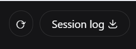

# dsh-quick-refresh

DSH 桌面客户端主动刷新/热应用插件。

> **适用对象**：DSH **桌面版**（如 EAC 客户端）用户。
> 浏览器（Web）版本身就自带刷新——直接在浏览器里刷新页面即可让客户端插件重新加载，
> 不需要本插件；桌面版没有原生刷新入口，改完 `cordis.patch.yml` 想生效只能重启客户端，
> 本插件正是为此提供界面内一键「刷新并应用」，免重启。

开源：**MIT License**，可自由使用、修改、再分发。
仓库：<https://github.com/konwait12/dsh-quick-refresh>

## 功能

- 在 **会话页右上角 “session log（轨迹）”标签左侧** 并排插入一个图标按钮（克隆该标签的外观与图标形态）；同时保留 **设置 → 插件 → 刷新** 面板。

  

- 点击后 host 端会：
  1. 重新读取 `profiles/web/cordis.patch.yml`，把 `disabled: true/false` 应用到当前正在运行的 Loader 条目（无需重启 dsh web）。
  2. 尝试热挂载 profile 中新增的简单插件（纯 `id/name` insert 行）。
- 应用成功后自动刷新页面，让 client 插件状态生效。

## 适用场景

- 使用 DSH **桌面版**（如 EAC 客户端），手动改了 `cordis.patch.yml` 想立刻生效，又不想重启客户端。
- 桌面版通过插件市场/手动方式装了新插件，但市场没有自动热挂载时，手动点一下「刷新并应用」。
- 浏览器版用户无需安装本插件：浏览器自带刷新，刷新页面即可重载客户端插件。

## 安装

```sh
dsh plugin --profile web add ./dsh-quick-refresh
# 或手动复制到 ~/.dsh/profiles/web/node_modules/dsh-quick-refresh
# 并在 cordis.patch.yml 增加：
# - insert:
#     - id: quick-refresh
#       name: 'dsh-quick-refresh'
```

首次安装后需要重启一次 dsh web，之后就可以用「刷新」按钮热应用。

## 开源与发布

仓库：<https://github.com/konwait12/dsh-quick-refresh>

本地已带好：

- MIT License
- `.github/workflows/ci.yml`：GitHub Actions CI
- `CONTRIBUTING.md`：贡献指南
- `CHANGELOG.md`：变更日志
- `publish.ps1`：一键创建 GitHub 仓库并推送

推送并创建仓库：

```powershell
powershell -ExecutionPolicy Bypass -File .\publish.ps1
```

发布到 npm（可选）：

```sh
npm login
npm publish --access public
```

## 限制

- 只能热应用已存在于 profile 里的插件/补丁；新增带复杂 `config` 的插件仍可能需要重启。
- 若 `@deepseek-ai/cordis-plugin-include` 不可用，热挂载新插件会跳过，但「应用 disabled 状态 + 刷新页面」仍可用。
